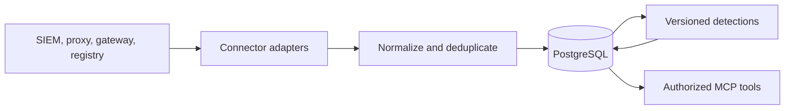

# Architecture overview

One process hosts the official MCP Python SDK's Streamable HTTP endpoint, the scheduled worker, normalization and detection modules, and PostgreSQL access. The same process supports stdio in explicit local development mode. The ASGI shell supplies `/healthz`, `/readyz`, and `/metrics`; the MCP endpoint contains six investigation tools and no mutation tools. An optional same-origin UI at `/ui/` calls the same investigation service through authenticated read-only JSON routes.

The poller uses source cursors or a time-window checkpoint. Each page is committed before its cursor advances. A rejected record marks a partial batch and leaves the checkpoint at the prior page for repair and replay. PostgreSQL advisory locks prevent two processes from synchronizing the same connector simultaneously. Replayed observations and findings use stable hashes, so a restart does not create duplicates. The detector runs after a sync cycle and records run status.

The server can operate with a subset of connectors. A missing route or registry source appears in tool warnings and reduces detection confidence. Approval decisions rely on the latest successfully imported registry snapshot; stale data is explicitly described as a limitation. No prompt content or tool payload enters the normalized model.

Correlation requires a time window and an identity, device, nonshared source IP, or exact correlation ID. A domain match recognizes a candidate service but cannot prove a specific user's access. Detection rules never execute source text as instructions.
